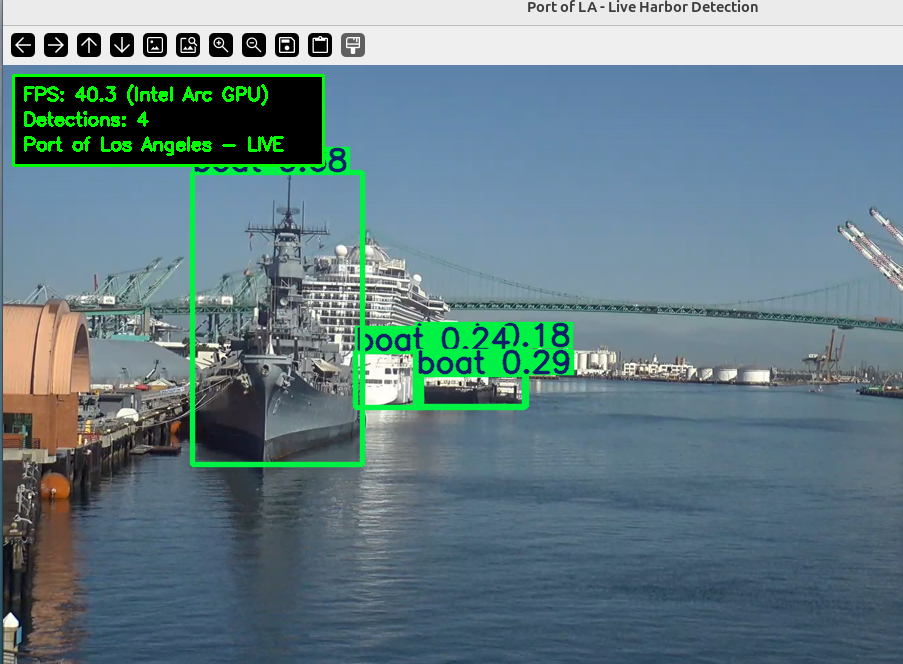

# yolo-harbor-edge

Real-time object detection for harbor surveillance using YOLOv8 with OpenVINO backend, optimized for Intel Arc GPUs.

## Overview

This project provides edge-based computer vision for maritime surveillance, capable of detecting ships, vehicles, people, and other objects in harbor environments. It's designed to run efficiently on Intel integrated and discrete GPUs using OpenVINO acceleration.

**Live Demo:** Streams from the Port of Los Angeles EarthCam feed, detecting the USS Iowa, container ships, cranes, and harbor activity in real-time.


*Real-time detection at Port of Los Angeles - USS Iowa (left) detected as "boat" at 40+ FPS on Intel Arc GPU*

## Features

- **Real-time Detection**: 38+ FPS on Intel Arc GPU with YOLOv8s
- **OpenVINO Acceleration**: Optimized inference on Intel GPUs (Arc, Iris Xe, UHD)
- **Live Streaming**: Connect to RTSP, HLS, or HTTP video streams
- **Harbor-Optimized**: Tuned confidence thresholds for maritime environments
- **Extensible Output**: Local file saving, with hooks for S3/Kinesis integration
- **Auto-Reconnect**: Resilient streaming with automatic reconnection on failure

## Hardware Requirements

| Component | Minimum | Recommended |
|-----------|---------|-------------|
| CPU | Intel 8th Gen+ | Intel Core Ultra (Meteor Lake) |
| GPU | Intel UHD 620 | Intel Arc (integrated or discrete) |
| RAM | 8 GB | 16 GB |
| Storage | 2 GB free | SSD recommended |

### Tested On
- **Intel Core Ultra 7 155H** with Intel Arc Graphics (Meteor Lake-P)
- Ubuntu 24.04 LTS
- OpenVINO 2025.4.1

## Installation

### 1. System Dependencies

```bash
# Ubuntu/Debian
sudo apt update
sudo apt install -y ffmpeg intel-opencl-icd

# Optional: Level Zero for NPU support
sudo apt install -y intel-level-zero-gpu level-zero
```

### 2. Python Dependencies

```bash
pip install opencv-python ultralytics openvino requests
```

### 3. Verify GPU Detection

```python
from openvino import Core
core = Core()
print("Available devices:", core.available_devices)
# Should show: ['CPU', 'GPU'] or ['CPU', 'GPU', 'NPU']
```

## Usage

### Harbor Detector (Video Files & Streams)

Process local video files or RTSP/HTTP streams:

```bash
# Local video file
python harbor_detector.py --source sample.mp4

# RTSP stream
python harbor_detector.py --source rtsp://camera.local/stream

# HTTP stream
python harbor_detector.py --source https://example.com/harbor.mp4

# Adjust confidence threshold
python harbor_detector.py --source sample.mp4 --conf 0.4

# Run headless (no display window)
python harbor_detector.py --source sample.mp4 --no-display

# Force specific device
python harbor_detector.py --source sample.mp4 --device GPU
```

**Options:**
| Flag | Default | Description |
|------|---------|-------------|
| `--source`, `-s` | required | Video source (file, URL, or RTSP) |
| `--model`, `-m` | yolov8n_openvino_model | Path to OpenVINO model |
| `--conf`, `-c` | 0.5 | Detection confidence threshold |
| `--device` | auto | OpenVINO device: auto, CPU, GPU, NPU |
| `--save-dir` | ./detections | Output directory for frames |
| `--save-interval` | 30 | Save every N frames |
| `--no-display` | false | Run without GUI window |

### Live Harbor (Port of LA EarthCam)

Stream live from the Port of Los Angeles with real-time detection:

```bash
python live_harbor.py
```

**Controls:**
- `q` - Quit
- `s` - Save snapshot

**Features:**
- Auto-fetches fresh stream tokens from EarthCam
- Resilient reconnection on stream failures
- Optimized for night/low-light conditions (conf=0.15)

## Models

### Current Models

| Model | Parameters | Size | FPS (Arc GPU) | Accuracy | Status |
|-------|------------|------|---------------|----------|--------|
| YOLOv8n | 3.2M | 6 MB | ~51 FPS | Good | Available |
| **YOLOv8s** | 11.2M | 43 MB | ~38 FPS | **Better** | **Default** |
| YOLOv8m | 25.9M | 100 MB | ~22 FPS | Best | Planned |

### Exporting New Models

Convert any YOLOv8 model to OpenVINO format:

```python
from ultralytics import YOLO

# Download and export
model = YOLO('yolov8s.pt')  # or yolov8n, yolov8m, yolov8l, yolov8x
model.export(format='openvino', half=False)
```

### Future Models

| Model | Purpose | Status |
|-------|---------|--------|
| YOLOv8m-OpenVINO | Higher accuracy detection | Planned |
| YOLOv8-Maritime | Fine-tuned on ship/vessel data | Research |
| YOLOv8-Night | Optimized for low-light conditions | Research |
| RT-DETR | Transformer-based detection | Evaluation |
| Custom Harbor Model | Fine-tuned on Port of LA footage | Future |

### Detection Classes

Using COCO dataset classes relevant to harbor surveillance:

| Class ID | Name | Harbor Relevance |
|----------|------|------------------|
| 0 | person | Dock workers, security |
| 2 | car | Port vehicles |
| 5 | bus | Transport shuttles |
| 7 | truck | Container trucks, semis |
| 8 | boat | Ships, tugboats, vessels |
| 14 | bird | Seagulls, pelicans |

**Note:** Large vessels like the USS Iowa may be detected as "boat", "train", or "bus" depending on angle and lighting - COCO wasn't trained on battleships!

## Architecture

```
┌─────────────────┐     ┌──────────────┐     ┌─────────────────┐
│  Video Source   │────▶│   FFmpeg     │────▶│  OpenCV Frame   │
│  (RTSP/HLS/MP4) │     │  (decoder)   │     │   Processing    │
└─────────────────┘     └──────────────┘     └────────┬────────┘
                                                       │
                                                       ▼
┌─────────────────┐     ┌──────────────┐     ┌─────────────────┐
│  Output Display │◀────│   YOLOv8     │◀────│   Intel Arc     │
│  / File Save    │     │  Detection   │     │   GPU (OpenVINO)│
└─────────────────┘     └──────────────┘     └─────────────────┘
```

## Output Handlers

The detector supports extensible output handlers:

| Handler | Status | Description |
|---------|--------|-------------|
| `LocalFileHandler` | Implemented | Save frames to local directory |
| `S3Handler` | Placeholder | Upload to AWS S3 bucket |
| `KinesisVideoHandler` | Placeholder | Stream to AWS Kinesis Video |

### Adding Custom Handlers

```python
class MyHandler:
    def write(self, frame, metadata: dict) -> None:
        # metadata contains: fps, detection_count, timestamp, detections
        pass

    def close(self) -> None:
        pass

# Add to detector
detector = HarborDetector(model_path, handlers=[MyHandler()])
```

## Performance Tuning

### Confidence Threshold
- **Daytime**: `--conf 0.4` to `0.5` (reduce false positives)
- **Nighttime**: `--conf 0.15` to `0.25` (catch more objects)
- **High Activity**: `--conf 0.5` to `0.6` (focus on clear detections)

### Device Selection
```bash
# Auto-select best device (GPU > NPU > CPU)
--device auto

# Force Intel GPU
--device GPU

# Force CPU (for debugging)
--device CPU
```

### Frame Rate
The live streamer limits to 12 FPS by default for stability. Adjust in `create_ffmpeg_reader()`:
```python
'-r', '15',  # Increase for smoother video
'-r', '8',   # Decrease for lower CPU usage
```

## Troubleshooting

### GPU Not Detected
```bash
# Install Intel compute runtime
sudo apt install intel-opencl-icd

# Verify
python -c "from openvino import Core; print(Core().available_devices)"
```

### Stream Connection Failed
- EarthCam tokens expire quickly - the script auto-refreshes
- Check internet connection
- Try: `QT_QPA_PLATFORM=xcb python live_harbor.py`

### Low FPS
- Ensure GPU is being used (check "Using device: intel:gpu" in output)
- Close other GPU-intensive applications
- Try YOLOv8n for faster inference

### Display Window Issues
```bash
# Wayland fix
QT_QPA_PLATFORM=wayland python live_harbor.py

# X11 fallback
QT_QPA_PLATFORM=xcb python live_harbor.py
```

## Roadmap

- [ ] Add YOLOv8m model for improved accuracy
- [ ] Implement S3 upload handler
- [ ] Add Kinesis Video Streams integration
- [ ] Fine-tune model on maritime dataset
- [ ] Add object tracking (ByteTrack/BoT-SORT)
- [ ] Multi-camera support
- [ ] Web dashboard for monitoring
- [ ] Alert system for specific detections
- [ ] NPU acceleration support

## License

MIT License - See LICENSE file for details.

## Acknowledgments

- [Ultralytics YOLOv8](https://github.com/ultralytics/ultralytics)
- [Intel OpenVINO](https://github.com/openvinotoolkit/openvino)
- [EarthCam Port of LA](https://www.earthcam.com/usa/california/losangeles/port/)
- USS Iowa Museum - The "train" in our harbor
